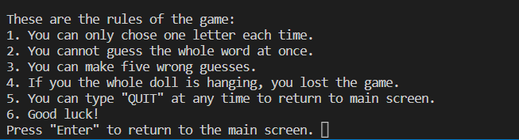
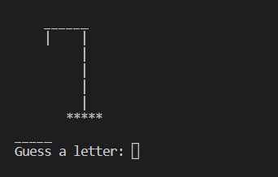
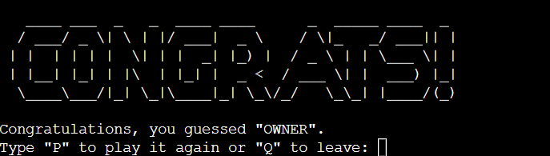
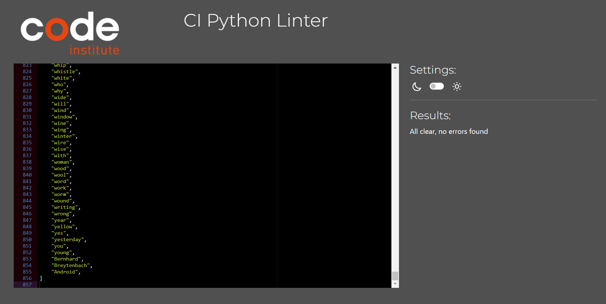

# **The Hangman**
## **Overview**
The Hangman is an application made on Python. It is a game that challenges the user to get the correct word within six chances. It time the user guesses incorrectly, a part of the doll is added to the hangman design, if all parts are completely the user loses the game.

​
## Table of contents:
1. [**Overview**](#overview)
1. [**Planning stage**](#planning-stage)
    * [***Target Audiences***](#target-audiences)
    * [***User Stories***](#user-stories)
    * [***Site Aims***](#site-aims)
1. [**Current Features**](#current-features)
    * [***Main Screen***](#main-screen)
    * [***Difficulty selection***](#difficulty-selection)
    * [***Rules***](#rules)
    * [***Game***](#game)   
    * [***Congratulations and Game Over***](#congratulations-and-game-over)
1. [**Future-Enhancements**](#future-enhancements)
1. [**Testing Phase**](#testing-phase)
1. [**Validators**](#validators)
1. [**Tech**](#tech)
1. [**Credits**](#credits)
    * [**Honorable mentions**](#honorable-mentions)
    * [**Content**](#content)
​
## **Planning stage**
### **Target Audiences:**
* Users interested in hangman games.
* Users interested in quick games to spend some time.
* Users interested in challenge themselves with their words knowledge.
​
### **User Stories:**
* As a user, I want to have fun.
* As a user, I want to know the rules to the game.
* As a user, I want to be able to choose how difficult the game is going to be.
* As a user, I want to be aware of how many errors I have made.
* As a user, I want to keep track of all the letters I have guessed.
* As a user, if I lose, I want to know the word I did not guess.
* As a user, I want to replay the game as many times as I want.
​
### **Site Aims:**
* To provide a fun game.
* To create a challenge for the user.
* To provide an excellent user experience without any errors or bugs.
​
## **Current Features**
​
#### *Main Screen:*

* Main screen of the game. User can choose to start the game.

#### *Difficulty selection:*

* Once the user enters the game, they are requested to choose the difficulty. The difficulty is based on the length of the word. Depending on what difficulty level the user chooses, the code runs and returns a word from a list.

#### *Rules:*

* After the user chooses the difficulty, the rules are presented. Aiming for the user experience, the user is informed of what expected from the game and how to proceed correctly so that they can have the best experience with the game.

#### *Game:*

* The game starts with three main parts: the hangman design (empty, because there is no mistakes yet), the random word hidden and the request for the user to guess a letter. Once the user guesses the first letter, two more items are added to the game: the used letters lists (so the user can see which letters they already guessed) and the amount of mistakes they made.

#### *Congratulations and Game Over:*

* There is two outcomes of the game: the user can either win or lose. If they win, they are greeted with a congratulations message and an invitation to play again. If the user loses, they receive a Game Over message, the information of what was the word and also the invitation to replay the game.

​
## **Future-Enhancements**
​
* Color can be added to the game to provide a better user experience. 
​
## **Testing Phase**
​

Implementation: Main screen offers the user the option to play the game.

Test: Access the game and pressed the correct option to start the game.

Result: Game started.
*** 

Implementation: Prevent user of typing wrong keys while starting the game.

Test: Tried wrong keys as input.

Result: Game informs that the keys are incorrect and did not started.
***

Implementation: Offer the user the option to exit the game in the main screen.

Test: Typed "exit" on the main screen.

Result: Game finished.
***

Implementation: Once the game starts, user can choose the difficulty.

Test: Tried the correct inputs and wrong ones.

Result: The correct ones allowed the game to start with the parameters considered for the chosen level, wrong keys did not allow the game to start.
***

Implementation: Once the game starts, the user can choose one letter.

Test: Started the game and guessed a word.

Result: Game continued.
***

Implementation: Prevent user to type a full word or numbers.

Test: Typed a random words and numbers.

Result: Game informed that those inputs were not accepted and requested user to type just a letter.
***

Implementation: Game allows to user to make five wrong guesses before finishing the game.

Test: Made five wrong guesses.

Result: On the sixth wrong guess, the game finished.
***

Implementation: Allow user to finish the game at any moment during the game, typing "exit".

Test: Typed "exit" during the game.

Result: Game finished.
***

Implementation: Allow user to replay the game when the game finishes.

Test: Finished the game, losing and winning, and tried to replay the game.

Result: Game rebooted.
***

Implementation: Allow user to exit the game when the game finishes.

Test: Finished the game, losing and winning, and tried to exit the game.

Result: Exited the game.
***

## **Validators**

. Python Linter [Python Linter Validator](https://pep8ci.herokuapp.com/)

Only error related to the ASCII graphics (W605)

​
## **Bugs**

Problem 🐞: Game continued even after six wrong guesses.

Cause🛠: Input code would run twice within the while loop.

Resolution✅: Removed the unnecessary input call.
***

Problem 🐞: If a incorrect key was used to chose the difficulty the game was rebooted.

Cause🛠: The function being called was wrong.

Resolution✅: Change the structure of function and function being called.
***

## **Deployment**
I deployed the page on Heroku via the following procedure: -
​
1. Push the code to the Github [repository](https://github.com/AlexDralur/hangman-game-python).
2. Log in or Sign up to Heroku where you need to create a new app.
3. Select a unique name.
4. In the settings tab reveal the config vars, for this project one had to be added per Code Institutes guidance.
5. For KEY, input PORT and for VALUE, input 8000 and click add.
6. Below that, click add buildpack, select Python and save.
7. Click add buildpack again, now select Nodejs and save.
8. Python should be above Nodejs on the buildpack list.
9. Go to deploy tab and for deployment method select GitHub and connect your GitHub account.
10. When prompted enter the repository you want to deploy, search and once found connect it.
11. Now you can either set it automatically or manually deploy the appropriate branch.
12. Automatically will deploy the app everytime you push something to GitHub.
13. Manually you have control over when the app should be deployed, but you have to remember to do it.
14. It might take a little while, but once the app is built Heroku will have a link to the live web page.

You can find the game live via the following URL - [live game](https://hangman-alexander-78ba1ad29a14.herokuapp.com/)
***
​
## **Tech**
- Python
​
## **Credits**
### **Honorable mentions**
* Larissa Moura (my wife) - She was my tester and also my design guru.
* Richard Wells (my Code Institute tutor) - Help me throughout the project in all aspects.
​
### **Content:**

. Words taken from the words.txt [Github](https://github.com/Xethron/Hangman) from Xethron.
. Word Graphics (ASCII art) taken from [TextKool](https://textkool.com/en)
. Code to run through the hidden word and only the letter which was guessed, if correct, from the Python tutorial [Youtube](https://www.youtube.com/watch?v=m4nEnsavl6w) from Kite.